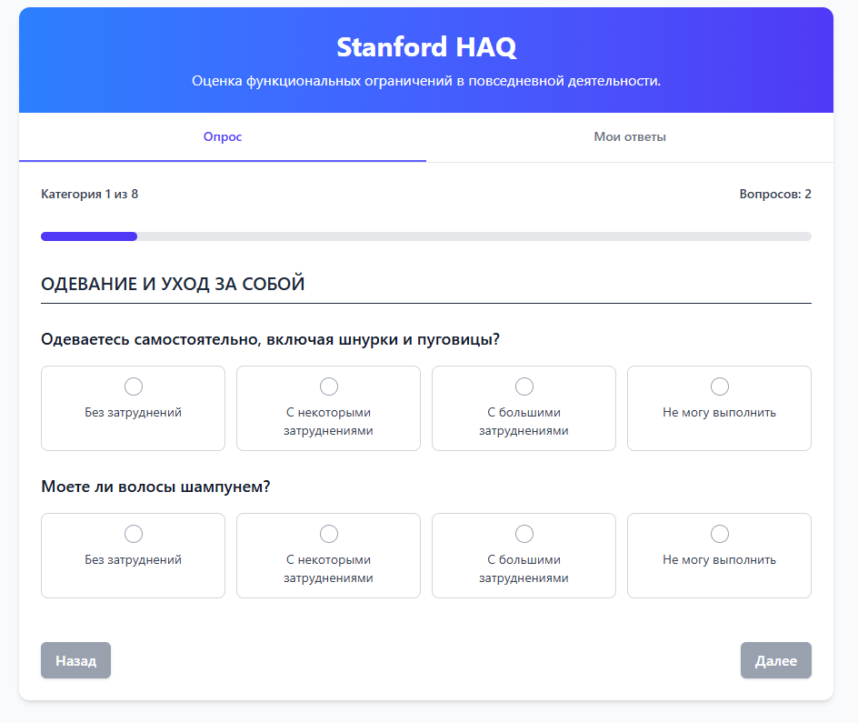

# HAQ-DI Calculator (Stanford Health Assessment Questionnaire)

## Пример работы

Живая версия приложения доступна по адресу:  
[medicalhaqcalculator.netlify.app](https://medicalhaqcalculator.netlify.app/)



## Описание

Онлайн-калькулятор для оценки функциональных ограничений по стандартизированной методике Stanford Health Assessment Questionnaire Disability Index (HAQ-DI). Приложение позволяет:

- Пройти полный опросник HAQ-DI (20 вопросов по 8 категориям)
- Сохранять результаты обследований
- Просматривать историю оценок
- Экспортировать результаты в PDF
- Анализировать динамику состояния пациента

## Технологии

- **Frontend**: React
- **UI**: Tailwind CSS
- **PDF генерация**: jsPDF + jspdf-autotable
- **Хранение данных**: IndexedDB
- **Хостинг**: Netlify

## Установка и запуск

1. Клонируйте репозиторий:

```bash
git clone https://github.com/4uJustDev/medical_calculator_haq
cd medical_calculator_haq
```

2. Установите зависимости:

```bash
npm install
```

3. Запустите приложение:

```bash
npm run dev
```

## Особенности реализации

- **Полная поддержка кириллицы** в PDF отчетах
- **Адаптивный интерфейс** для работы на любых устройствах
- **Локальное хранение** данных (не требует сервера)
- **Печатные формы** результатов обследования
- **Интуитивный UX** с пошаговым прохождением опросника

## Использование

1. Введите данные пациента (ФИО, возраст, пол)
2. Пройдите все вопросы опросника (20 вопросов)
3. Просмотрите результаты с интерпретацией
4. Сохраните результат или экспортируйте в PDF
5. В любой момент можно просмотреть историю обследований во вкладке "Мои ответы"
